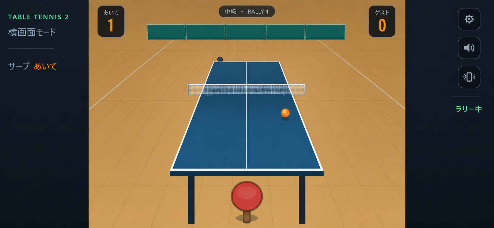
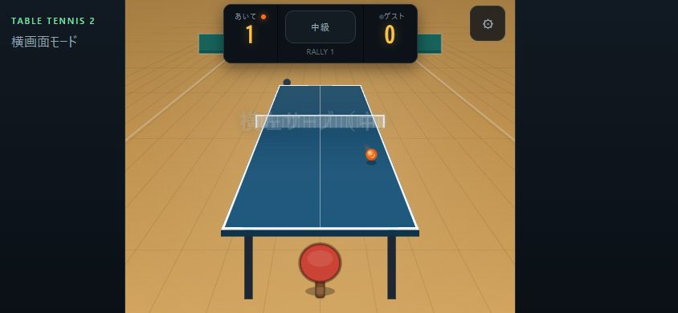

# 修正設計書：横画面HUDのコーナースコア化

本書は、公開済み `table-tennis2` v0.1.0 の横画面HUDを、ユーザー選択案3「コーナースコア」へ改修する v0.1.1 の実装正本である。得点表示を中央上部の一体型ボードからステージ左右上隅の小型バッジへ分離し、左右レールを試合情報と既存操作へ活用する。ゲームルール、物理、AI、入力座標、保存データ、公開URLは変更しない。

- 作成日: 2026-08-03
- 対象アプリ: table-tennis2
- 種別: 修正設計書
- 対象バージョン: v0.1.1
- 前提コミット: `184c224eb34faecbeb1d4501a437215941813dcf`
- ステータス: 実装済み・公開済み（正本）
- 関連: [設計書インデックス](./設計書インデックス.md) / [v0.1.0 横画面版全体設計](./実装設計書_横画面版全体設計_2026-08-03.md) / [実装ログ](./実装ログ.md) / [選択モック](./assets/mock_corner-score_concept_2026-08-03.png) / [現行画面](./assets/current_hud_844x390_2026-08-03.png)

## 1. 目的・背景

公開版を Chrome の 844×390 横画面で確認したところ、中央上部の `#board` は約242×74pxで、幅約485pxのstage中央を大きく占有している。得点は読みやすい一方、飛球を見る中央上部へ常時重なり、横画面スマートフォンではプレイ領域が狭く感じられる。

一方、wide landscapeでは左レールの `#hudSecondary` が空で、ラリー中は右レールの `#serveControls` も非表示となるため、左右の余白を十分に活用できていない。

本修正の目的は次の3点である。

1. 得点の判読性を維持しながら、中央上部の遮蔽を小さくする。
2. wide時の左右レールを、試合情報と既存の設定・音・振動操作へ活用する。
3. compact時に左レールが消えても、両者の得点とサーバー表示が失われないレスポンシブ契約を固定する。

## 2. ユーザー決定と参照方針

### 2.1 採用案

ユーザー提示の3案から、案3「コーナースコア」を採用する。



この画像は情報配置と視覚的方向性を示すコンセプトであり、生成画像内のピクセル値を実装値とはしない。寸法、ブレークポイント、文言、状態遷移、アクセシビリティは本書を正本とする。

### 2.2 Ping Pong Furyから参考にする範囲

スマートフォン用卓球ゲーム `Ping Pong Fury` は、公式サイトと配信ページで、スワイプ主体の打球、回転・カット・サーブ、短時間で進む1対1対戦、試合会場や進行要素を特徴としている。

- 公式サイト: <https://pingpongfury.com/>
- Google Play: <https://play.google.com/store/apps/details?id=uk.co.yakuto.PingPongKing>

本修正では、次の抽象的な体験原則だけを参考にする。

- ジェスチャー入力中は中央のプレイ領域を優先し、恒常HUDを小さくする。
- 得点、サーバー、ラリー状態を短い視線移動で把握できるようにする。
- 打球中に設定操作が必要になっても、画面中央を覆う前にレールから到達できるようにする。
- 体育館、濃紺、ミント、オレンジという `table-tennis2` 固有の視覚言語を維持する。

次の要素は本修正へ持ち込まない。

- 固有の画面構成、アート、アイコン、文言、サウンド、数値バランスの複製
- リアルタイム対人戦、フレンド対戦、ランキング
- リーグ、シーズン、ファン、報酬、装備、課金、広告
- 相手製品名やブランドを製品UIへ表示すること

オンライン対戦や進行システムは、認証、バックエンド、同期、切断復帰、不正対策、プライバシー、運用費を伴う。追加する場合は本書へ追記せず、別の機能設計書で扱う。

## 3. 現行仕様と問題

### 3.1 確認済みの現行契約

| 領域 | 現行事実 | 維持方針 |
|---|---|---|
| viewport | 568×320以上の横画面を許可。568〜759pxはstage+right rail、760px以上はleft rail+stage+right rail | 境界値を変更しない |
| stage | Canvas、HUD、入力、描画はstage実寸を基準にする | 入力・描画契約を変更しない |
| 得点HUD | `#board`内に `#scA`、`#scP`、`#lvName`、`#rally`、`#sA`、`#sP`、`#hudPlayerName` がある | IDと更新意味を維持する |
| 設定 | `#gear`から一時停止を開く | ハンドラーとIDを維持し、配置だけ右レールへ移す |
| 音・振動 | タイトルの `#tgS` / `#tgV`、一時停止の `#tgS2` / `#tgV2` が同一状態を操作する | 既存ボタンを残し、ゲーム中用ボタンを追加する |
| 左レール | ブランド、横画面モード、空の `hud-secondary` slot | 読み取り専用の試合文脈を追加する |
| 右レール | プレイヤーサーブ時だけ `serve-panel` featureを表示 | サーブUIと恒常操作を共存させる |
| PWA | package v0.1.0、cache `table-tennis2-v0.1.0`、公開URL `/sitar/table-tennis2/` | v0.1.1へ更新し、URLとPWA identityは維持する |

### 3.2 現行画面



844×390確認時の主な問題は次のとおりである。

- 一体型 `#board` がstage中央上部で約242×74pxを占有する。
- 得点、難易度、ラリー数を一つの暗色パネルへ集約しているため、得点以外の小情報にも同じ高さが必要になる。
- `#gear` がstage右上に重なり、右レールがあるwide時も中央領域側の操作となる。
- ラリー中はright railがほぼ空、left railの `#hudSecondary` は常に空である。

## 4. スコープ（対象範囲）

### 4.1 対象に含む

- `#board`を、左右の得点バッジと中央の試合メタ表示へ再構成する。
- wide / compactの2状態でHUD寸法と配置を切り替える。
- `#gear`をright railへ移動する。
- ゲーム中用の音・振動ボタンをright railへ追加し、既存設定状態へ接続する。
- left railの `hud-secondary` slotへ、現在サーバーを示す読み取り専用FeatureModuleを追加する。
- ゲーム状態文言、ボタン状態、長いプレイヤー名、safe area、アクセシビリティを整える。
- DOM/CSS契約、単体テスト、3環境E2E、PWA版数・cache版数、README、設計索引、実装ログを更新する。

### 4.2 対象外

- 得点ルール、11点先取、2点差、サーブ交代
- 物理、AI、乱数順、球種、サーブ種類・長さ、打球判定
- Canvas描画、カメラ、stage rect、pointer・flick座標変換
- IndexedDB名、schema、validator、戦績集計、既存データ
- viewport許可境界、停止理由合成、回転案内
- PWA名、manifest identity、アイコン、公開URL、ローカルポート
- 既存 `table-tennis` のコード、UI、URL、保存領域
- Ping Pong Furyのオンライン対戦、進行、装備、会場、収益化要素

## 5. 採用方針・代替案・トレードオフ

### 5.1 採用方針

既存HTML Canvas + TypeScript + CSSを維持し、DOMの小さな再配置と既存UI更新経路の拡張だけで実装する。得点バッジはレールではなくstage内に置く。これにより、left railが非表示になるcompactでも両得点を常に表示できる。

コアの設定・音・振動操作は `Ui` が扱い、読み取り専用の左レール文脈だけを既存 `FeatureModule` で実装する。featureのcommandを、配置変更だけのために増やさない。

### 5.2 採用しない案

| 案 | 不採用理由 |
|---|---|
| 中央ボードを単純に縮小 | 得点以外の要素を一体化したままで、中央上部の遮蔽構造が残る |
| 得点を左右レールへ完全移動 | compactではleft railが非表示になり、相手得点または自分得点の配置が非対称になる |
| Canvasへ得点を描画 | DOMアクセシビリティ、テスト容易性、プレイヤー名の省略表示、既存ID契約を失う |
| React等へ移行 | CSS/DOMだけで解決でき、依存と回帰範囲を増やす必要がない |
| 汎用HUDレイアウトエンジンを追加 | 2ブレークポイントと固定要素だけであり、YAGNIに反する |

### 5.3 トレードオフ

- 両上隅に小さな暗色面が残る。ただし中央へ74px高の一体パネルを置く現行より遮蔽範囲を局所化できる。
- 長いプレイヤー名はバッジ幅に合わせて省略する。完全名は `aria-label` とタイトル／戦績画面で確認できるようにする。
- ゲーム中用の音・振動ボタンが既存ボタンと重複する。状態とハンドラーは共通化し、別状態を持たせない。
- プレイヤーサーブ時はサーブ選択を優先するため、right railの音・振動ボタンを隠す。その間も設定を開けば一時停止画面から操作できる。

## 6. UI詳細設計

### 6.1 DOM構成

既存IDを維持し、概念上は次の構成へ変更する。

```html
<section id="stage" class="stage" aria-label="卓球台">
  <canvas id="cv"></canvas>
  <section id="board" class="match-hud" aria-label="試合スコア">
    <div id="opponentScoreCard" class="score-badge score-badge--opponent">
      <div class="lbl">あいて<span id="sA" class="serve"></span></div>
      <div class="num" id="scA">0</div>
    </div>
    <div id="matchMeta" class="match-meta">
      <span id="lvName">中級</span>
      <span aria-hidden="true">・</span>
      <span id="rally">RALLY 0</span>
    </div>
    <div id="playerScoreCard" class="score-badge score-badge--player">
      <div class="lbl"><span id="sP" class="serve"></span><span id="hudPlayerName">あなた</span></div>
      <div class="num" id="scP">0</div>
    </div>
  </section>
  <div id="flash" aria-live="polite"></div>
  <div id="hint" aria-live="polite"></div>
</section>

<aside id="rightRail" class="app-rail app-rail--right" aria-label="操作パネル">
  <section id="railMatchTools" class="rail-match-tools" aria-label="試合操作">
    <button id="gear" type="button">設定</button>
    <button id="tgSHud" type="button" aria-pressed="true">音</button>
    <button id="tgVHud" type="button" aria-pressed="true">振動</button>
    <div id="playStatus">ラリー中</div>
  </section>
  <section id="serveControls">...</section>
</aside>
```

`#scA`、`#scP`、`#lvName`、`#rally`、`#sA`、`#sP`、`#hudPlayerName`、`#gear`は削除・改名しない。現行E2Eと `Ui.requiredElement()` の契約を維持する。

### 6.2 共通HUD配置

- `#board`はstage基準の `position: absolute` とし、`position: fixed`を廃止する。
- `#board`自体は全面の背景、border、shadowを持たず、左右バッジと中央メタだけが個別の面を持つ。
- stage上端から8〜10px、左右端から8〜12px内側へ配置する。safe areaは既存 `.app-shell` のpaddingで一度だけ処理し、HUD側で重ねて加算しない。
- `#board`と子要素は `pointer-events: none` とし、Canvasジェスチャーを遮らない。
- 相手バッジはstage左上、プレイヤーバッジはstage右上へ固定する。
- `#matchMeta`はstage上端中央へ置き、高さを28px以下にする。
- 得点バッジ同士を中央で連結しない。中央の飛球確認領域を連続した暗色面で覆わない。
- 背景は `rgb(8 13 18 / 82%)`、borderは `#2b3742`、得点は既存 `--led`、サーバー点は既存 `--ball`を使用する。

### 6.3 wide landscape（幅760px以上）

| 要素 | 規定値 |
|---|---|
| stage左右inset | 10〜12px |
| 得点バッジ | 幅92px、高さ48px以下、角丸10px |
| ラベル | 10〜11px、1行、省略記号あり |
| 得点 | 30px、line-height 1、中央揃え |
| 中央メタ | 幅132px以下、高さ28px以下 |
| 中央メタ文字 | 難易度11px、RALLY 10px、1行 |
| 左レール | 現行156pxを維持。ブランド、横画面モード、現在サーバーを表示 |
| 右レール | 現行196〜260pxを維持。設定・音・振動・状態、必要時にサーブ選択を表示 |

844×390では、両得点バッジをstage外端へ寄せ、中央には `中級・RALLY 1` 程度の1行だけを残す。中央メタの高さは現行 `#board` 約74pxの38%以下とする。

### 6.4 compact landscape（幅568〜759px）

| 要素 | 規定値 |
|---|---|
| stage左右inset | 8px |
| 得点バッジ | 幅76px、高さ44px以下、角丸9px |
| ラベル | 10px、1行、省略記号あり |
| 得点 | 26px、line-height 1 |
| 中央メタ | 幅112px以下、高さ24px以下 |
| 中央メタ文字 | 難易度10px、RALLY 9px、1行 |
| 左レール | 現行どおり非表示 |
| 右レール | 現行176〜240pxを維持 |

最小568×320でも、両得点バッジと中央メタはstage内に残す。左レールにしか存在しない必須情報を作らない。現在サーバーは `#sA` / `#sP` の点で確認できる。

### 6.5 left rail

`#hudSecondary`へ `matchContextFeature` を追加する。

- `id`: `match-context`
- `slot`: `hud-secondary`
- `FeatureServices.subscribe()`で状態を読み取り、`host`内だけを更新する。
- 表示は見出し `サーブ` と値 `あなた` / `あいて` のみを必須とする。
- `Game.state`を直接変更しない。command追加は行わない。
- `mount()`が返す解除関数でsubscribeを必ず解除する。
- compactではleft railごと非表示になるため、ゲーム進行に必要な唯一情報を持たせない。

将来、球種履歴や回転量を追加するときは、このfeatureへ無条件に混在させず、別FeatureModuleとして設計する。

### 6.6 right rail

- `#gear`をstageから `#railMatchTools`へ移動し、44×44px以上の操作領域を維持する。
- `#tgSHud`と `#tgVHud`を新設し、既存の `toggleSound()` / `toggleVibration()`へ接続する。
- `Ui.syncToggles()`は `tgS` / `tgS2` / `tgSHud`、`tgV` / `tgV2` / `tgVHud`を同じstateから更新する。各ボタンの `.on`と `aria-pressed`を一致させる。
- `#playStatus`は `serve`かつplayer serverなら `サーブを選ぶ`、`rally`なら `ラリー中`、それ以外は空文字とする。result、pause、titleの主情報は既存overlayを正本とする。
- `#playStatus`は通知用live regionにしない。ラリー状態の頻繁な更新を読み上げさせない。
- プレイヤーサーブ時は `#serveControls`を優先し、`#tgSHud`と `#tgVHud`を非表示にする。`#gear`は表示を維持する。
- ラリー中は `#serveControls`を非表示にし、設定・音・振動を縦方向の44px以上の行として表示する。
- 568×320でright rail全体に縦スクロールを要求しない。サーブ12ボタンの44×44px既存契約を維持する。

### 6.7 状態別表示

| 状態 | 得点バッジ | 中央メタ | left rail | right rail |
|---|---|---|---|---|
| title | overlay背面。状態は保持 | overlay背面 | overlay背面 | overlay背面 |
| player serve | 両得点・サーバー点 | 難易度・RALLY | `サーブ あなた` | 設定、`サーブを選ぶ`、serve controls。音・振動は隠す |
| opponent serve / rally | 両得点・該当サーバー点 | 難易度・RALLY | `サーブ あいて` | 設定・音・振動、`ラリー中` |
| user pause | 背面で保持 | 背面で保持 | 背面で保持 | 既存pause overlayを前面表示 |
| result | 最終得点を保持 | 最終RALLYを保持 | 最終serverを保持してよい | 既存result overlayを前面表示 |
| portrait / too-small | 既存viewport gateの背面 | 同左 | 同左 | 同左 |

## 7. UI更新・アーキテクチャ

### 7.1 Uiクラス

`Ui`へ次だけを追加する。

- `tgSHud` / `tgVHud` / `playStatus` のrequired element参照
- `bind()`でゲーム中用toggleを既存handlerへ接続
- `updateHud()`で既存得点・難易度・ラリー・server点に加えて `playStatus`を更新
- `syncToggles()`で全3箇所の音・振動ボタンのclassと `aria-pressed`を同期

新しい状態ストア、イベントバス、DOM探索の汎用ヘルパーは追加しない。

### 7.2 FeatureModule

`src/ui/features/match-context.ts`を追加し、`main.ts`の静的一覧を次の順序にする。

```ts
mountFeatures(
  [servePanelFeature, matchContextFeature],
  featureHosts,
  services,
);
```

`matchContextFeature`は読み取り専用であり、既存 `FeatureServices`を変更しない。UI文言を作る純粋関数を小さく公開し、DOMを使わない単体テストを可能にする。

### 7.3 変更してはいけない境界

- `GameState`のフィールド追加・意味変更を行わない。
- `Game`、`rules`、`physics`、`ai`、`render`、`input`へHUD都合の分岐を追加しない。
- `evaluateViewport()`の568 / 320 / 760を変更しない。
- stageのDOMRectをCanvasと入力の単一基準とする契約を維持する。
- featureへpause、sound、vibrationのcommandを追加しない。

## 8. アクセシビリティ・安全性

- 得点HUDは `aria-label="試合スコア"`を持つ。得点数値は視覚順とDOM順を相手→メタ→プレイヤーで一致させる。
- `#hudPlayerName`はCSSで省略しても、DOM textとアクセシブル名は完全なプレイヤー名を保持する。
- 非操作HUDは `pointer-events: none`、right railのbuttonだけを操作対象とする。
- 全ボタンは44×44px以上、keyboard focus-visibleを維持する。
- 音・振動ボタンは色だけで状態を示さず、`aria-pressed`とラベルを同期する。
- `prefers-reduced-motion`に反する新規アニメーションを追加しない。得点バッジの常時点滅、拡大縮小は行わない。
- プレイヤー名、保存値、ゲーム状態をconsoleへ出力しない。
- 外部通信、外部画像、外部フォント、解析SDKを追加しない。Ping Pong Furyの参照は設計判断だけであり、実行時依存を作らない。

## 9. データ・PWA・互換性

### 9.1 データ

- IndexedDB `table-tennis2`、version 1、players / matches / settingsのshapeを変更しない。
- migration、データ補正、削除、既存 `table-tennis` からの移行を行わない。
- 音・振動は既存 `GameState`と既存設定保存経路を使用する。

### 9.2 版数とcache

公開する場合は次を同一変更で揃える。

| 対象 | 変更 |
|---|---|
| `package.json` | `0.1.0` → `0.1.1` |
| `package-lock.json` | package版数を `0.1.1`へ同期 |
| `sw.js` | `table-tennis2-v0.1.1` |
| README | v0.1.1のコーナースコアとright rail操作を記載 |
| 設計索引 | 状態、反映コミット、公開証跡を更新 |
| 実装ログ | Phase 6の開始・検証・締めを記録 |

manifestのname、short_name、start_url、scope、id、display、orientation、iconsは変更しない。公開URLは `https://sitar-sitar.github.io/sitar/table-tennis2/` のままとする。

## 10. エラー処理・ログ

- 必須DOMが欠けた場合は現行 `requiredElement()`で起動時に明示的に失敗させる。nullを黙って無視しない。
- `matchContextFeature`のhostとfeature IDは既存検証を通す。subscribe解除漏れを単体テストで防ぐ。
- レイアウト崩れは製品ログではなくE2Eの矩形値で検出する。ユーザー端末のviewportや名前を外部送信しない。
- 音・振動ボタンの一部だけが更新できない状態を作らず、単一の `syncToggles()`で同期する。
- 既存のPWA登録失敗時挙動、保存失敗時のゲーム継続、値を出さないwarning方針を変更しない。

## 11. テスト計画

### 11.1 静的・単体

- `check:app`で既存HUD IDと新規 `opponentScoreCard` / `matchMeta` / `playerScoreCard` / `railMatchTools` / `tgSHud` / `tgVHud` / `playStatus`の存在を検査する。
- 同一IDが重複しないことを維持する。
- `matchContextFeature`の表示関数がplayer / opponent serverを正しく返す。
- `mount()`後にsubscribe更新が反映され、解除後は更新されない。
- `syncToggles()`対象となる3組の音・振動ボタンが同じclassと `aria-pressed`を持つ。
- 既存viewport境界テスト（567/568、319/320、759/760）を維持する。

### 11.2 E2E矩形受入

844×390と568×320で、`getBoundingClientRect()`を使って次を検査する。

1. 両得点バッジと中央メタがvisibleで、stage内に完全に収まる。
2. wideでは得点バッジ高さ48px以下、中央メタ高さ28px以下である。
3. compactでは得点バッジ高さ44px以下、中央メタ高さ24px以下である。
4. 相手バッジ、中央メタ、プレイヤーバッジの矩形が互いに重ならない。
5. 相手バッジ右端はstage中央より左、プレイヤーバッジ左端はstage中央より右にある。
6. wideではleft railが表示され、現在サーバーの文言が状態と一致する。
7. compactではleft railが非表示でも、両得点と両server点が確認できる。
8. `#gear`、`#tgSHud`、`#tgVHud`がright rail内にあり、表示時は44×44px以上である。
9. player serve時はサーブ12ボタンがviewport内・44×44px以上で、音・振動HUDボタンは非表示である。
10. rally時はserve controlsが非表示、音・振動HUDボタンが表示される。

### 11.3 機能回帰

- 開始直後の0-0、難易度表示、RALLY更新、server点、プレイヤー名更新を既存IDで確認する。
- `#gear`で一時停止し、再開・終了できる。
- title / HUD / pauseの各音・振動ボタンが同じ設定へ反映される。
- 9種類×3長さのサーブ選択、AIサーブ、ラリー、得点、結果、戦績保存を既存テストで確認する。
- portrait / too-small時にviewport gateが前面へ出てゲームが停止し、横画面復帰後に既存契約どおり再開する。
- build済み `dist`のPWA資産、cache版数一致、現在cache限定参照、制御済みオフライン再読み込みを確認する。

### 11.4 実行ゲート

```powershell
npm run check
npm run test:e2e:stability
```

- `npm run check`: lint、strict TypeScript、静的契約、build、dist検査、単体、3環境E2Eを全て成功させる。
- リリース前: worker 1・retry 0・3反復を成功させる。
- テスト件数だけでなく、844×390、568×320、759×320、760×320の対象viewportと製品DOM経路を照合する。

## 12. Chrome手動受入

実装後、`D:\my-app2`標準のユーザーChromeで次を確認する。

1. 844×390で中央の大きな一体型ボードが無く、案3の左右得点バッジになっている。
2. ボール、ネット、相手ラケットを見る中央領域が現行より広い。
3. 得点、難易度、ラリー数、サーバーが一目で判別できる。
4. left railに現在サーバー、right railに設定・音・振動・ラリー状態が表示される。
5. player serve時にサーブ選択が画面内へ収まり、設定を開ける。
6. 音・振動をHUDから切り替え、pause/titleの表示と一致する。
7. 568×320でleft railが無くても両得点が読め、サーブ操作を妨げない。
8. 長さ12文字のプレイヤー名がバッジ外へはみ出さない。
9. portrait gate、pause、result、戦績overlayが従来どおり表示される。
10. console warning / errorが0件である。

短い入力時間へ依存するSTOP/FLICKの手動実演は本UI修正の新規合格条件にしない。既存のPlaywright製品経路を回帰ゲートとする。

## 13. 実装フェーズ

本修正は `実装ログ.md` のPhase 6として扱う。ローカル実装、全自動検証、Chrome手動受入、visual QA、GitHub Pages公開確認を完了し、Phase 6は締め済みとする。

### Phase 6-1: 契約テスト

- 新規DOM、矩形、表示状態、toggle同期のテストを先に追加する。
- 現行実装で意図したfailになることを確認する。

### Phase 6-2: HUDとレール

- HTMLを再構成し、既存IDを維持する。
- stage相対のcorner score CSSを実装する。
- right rail操作と `matchContextFeature`を実装する。

### Phase 6-3: 回帰・文書・版数

- v0.1.1とService Worker cacheを同期する。
- README、設計索引、実装ログ、親 `PROJECT_OVERVIEW.md`を更新する。
- `npm run check`、安定性反復、Chrome手動受入を完了する。

### Phase 6-4: 公開（別途明示承認時のみ）

- root `table-tennis` とchild `table-tennis2` の合成Pages artifactを維持する。
- 対象Actions run、Pages deployment SHA、HTTP/PWA資産、Chrome公開URLを確認する。
- 公開を指示されていない段階ではcommit、push、workflow dispatch、Pages設定変更を行わない。

## 14. 受け入れ条件（完了条件）

### G1: ローカル実装完了

- 本書のDOM・寸法・状態契約を満たす。
- 既存ゲーム仕様、保存データ、viewport境界を変更していない。
- `npm run check`と安定性反復が成功する。
- Chromeの844×390と568×320受入を完了する。
- Phase 6締めチェックリストとObsidian Phase同期履歴を更新する。

### G2: 公開完了（公開指示がある場合）

- package / lock / child Service Workerがv0.1.1で一致する。
- root+child合成artifactの両アプリ検査が成功する。
- Actions build / deploy、Pages deployment SHA、公開HTTP/PWA資産が一致する。
- 公開URLをChromeで再読み込みし、案3HUD、開始、設定、console 0件を確認する。

## 15. リスク・注意点

| リスク | 対策 |
|---|---|
| 568×320でright railの設定とサーブ選択が縦に収まらない | player serve時は音・振動HUDボタンを隠し、矩形E2Eでviewport内を検査する |
| 得点バッジが端の打球を隠す | バッジを48px以下・外端寄せに固定し、844×390と568×320をChromeで確認する |
| 長いプレイヤー名が得点幅を押し広げる | バッジ幅を固定し、1行省略と12文字名E2Eを行う |
| title / HUD / pauseの音・振動状態がずれる | 単一 `syncToggles()`からclassと `aria-pressed`を全ボタンへ反映する |
| Service Workerが旧CSSを返す | package / lock / child cacheをv0.1.1で一致させ、現在cache限定参照と公開資産SHAを確認する |
| コンセプト画像が実装仕様として誤解される | 画像は方向性だけと明記し、寸法・文言・状態は本書本文を正本とする |

## 16. ロールバック

- ローカル段階ではPhase 6の変更ファイルだけを戻し、v0.1.0の一体型 `#board`へ復帰する。履歴を書き換えるresetやforce pushは使わない。
- 公開後は対象コミットを `git revert`し、root+child合成Pages workflowで再公開する。
- rollback後も公開URL、IndexedDB、manifest identityを変更しない。
- root Service Workerのchild pathname bypassを戻さない。
- rollback公開でもActions、deployment SHA、HTTP/PWA、Chromeを再確認する。

## 17. 未確定事項

- 本修正を実装するためのブロッキング事項はない。
- Ping Pong Furyを参考にしたリアルタイム対戦、リーグ、装備、複数会場は本書では未確定であり、実装しない。
- 公開は本設計作成とは別の明示指示が必要である。

## 変更履歴

| 日付 | 内容 |
|---|---|
| 2026-08-03 | commit `fad632b`（HUD実装）と `d4c802b`（Pages cache版数検査の恒久修正）を公開。Actions run `30810815952`、deployment `5725645750`、HTTP/PWA `Ready: true`、公開Chrome 844×390 / 568×320受入を確認し、「実装済み・公開済み」へ更新。 |
| 2026-08-03 | Phase 6のローカル実装、`npm run check`、安定性反復225件、Chrome 844×390 / 568×320受入、visual QAを完了し、「実装済み・公開確認待ち」へ更新。 |
| 2026-08-03 | ユーザーの実装・Web公開・push指示によりPhase 6を開始し、ステータスを「実装中」へ更新。 |
| 2026-08-03 | 新規作成。ユーザー選択案3「コーナースコア」を正本化し、wide/compact寸法、左右レール活用、既存ID・ゲーム仕様・保存領域の維持、v0.1.1検証・公開境界を定義。Ping Pong Furyはジェスチャー優先・中央視認性・短い状態把握だけを参考にし、固有UIやオンライン／進行／収益化要素を対象外とした。 |
